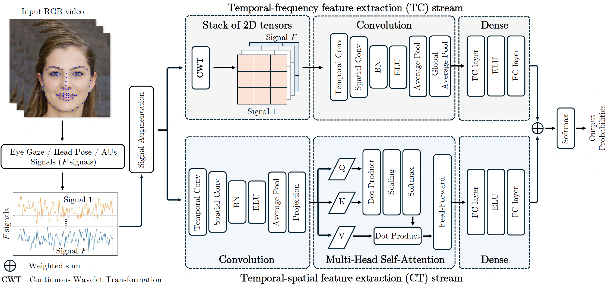

# TCCT-Net: Two-Stream Network Architecture for Fast and Efficient Engagement Estimation via Behavioral Feature Signals
This is the official repository for the paper "TCCT-Net: Two-Stream Network Architecture for Fast and Efficient Engagement Estimation via Behavioral Feature Signals," authored by [Alexander Vedernikov](https://scholar.google.com/citations?user=oiW3S7oAAAAJ&hl=en), [Puneet Kumar](https://scholar.google.com/citations?user=8ieLBZ8AAAAJ&hl=en&oi=ao), [Haoyu Chen](https://scholar.google.com/citations?user=QgbraMIAAAAJ&hl=en), [Tapio Seppänen](https://scholar.google.com/citations?user=MRSV_E8AAAAJ&hl=en), and [Xiaobai Li](https://scholar.google.com/citations?user=JTFfexYAAAAJ&hl=en). The paper has been accepted for the CVPR 2024 workshop (ABAW).



## Table of Contents
- [Preprint](#preprint)
- [About the Paper](#about-the-paper)
- [Requirements](#requirements)
- [Pre-processing](#pre-processing)
- [Dataset Files](#dataset-files)
- [Hardware Recommendations](#hardware-recommendations)
- [Model Weights](#model-weights)
- [Instructions](#instructions)
- [Usage](#usage)
- [Citing This Work](#citing-this-work)

## Preprint
The preprint of our paper can be accessed on arXiv: [TCCT-Net on arXiv](https://arxiv.org/abs/2404.09474)

## About the Paper
Engagement analysis finds various applications in healthcare, education, advertisement, services. Deep Neural Networks, used for analysis, possess complex architecture and need large amounts of input data, computational power, inference time. These constraints challenge embedding systems into devices for real-time use. To address these limitations, we present a novel two-stream feature fusion "Tensor-Convolution and Convolution-Transformer Network" (TCCT-Net) architecture. To better learn the meaningful patterns in the temporal-spatial domain, we design a "CT" stream that integrates a hybrid convolutional-transformer. In parallel, to efficiently extract rich patterns from the temporal-frequency domain and boost processing speed, we introduce a "TC" stream that uses Continuous Wavelet Transform (CWT) to represent information in a 2D tensor form. Evaluated on the EngageNet dataset, the proposed method outperforms existing baselines, utilizing only two behavioral features (head pose rotations) compared to the 98 used in baseline models. Furthermore, comparative analysis shows TCCT-Net's architecture offers an order-of-magnitude improvement in inference speed compared to state-of-the-art image-based Recurrent Neural Network (RNN) methods.

## Requirements
To install the necessary dependencies, please ensure you have the following packages:

- `einops==0.8.0`
- `matplotlib==3.6.2`
- `numpy==1.23.4`
- `pandas==1.5.2`
- `PyWavelets==1.4.1`
- `torch==1.13.0`
- `tqdm==4.64.1`

You can install these dependencies using the following command:

```bash
pip install -r requirements.txt
```

### Pre-processing
To begin, you will need access to the EngageNet dataset.

Initially, videos in their original RGB format are preprocessed using the OpenFace library to extract behavioral features such as Action Units (AUs), eye gaze, and head pose. After preprocessing, the validation videos are stored in the `test_files` folder, while the training videos are stored in the `train_files` folder. Each RGB video is converted into a CSV file with `F` columns, where each column represents a specific behavioral feature, and rows correspond to frames.

The preprocessing steps result in 6852 training samples and 1071 validation samples, each with a length of 280 elements. For evaluation, all 1071 validation set videos were used, and any shorter signals were repeated to reach 280 elements. For detailed information, please refer to section 4.2 of the [paper](https://arxiv.org/abs/2404.09474).

### Dataset Files
This repository includes the following key folders and files related to the training and validation data:

- `test_files`: Contains CSV files after validation videos preprocessing. One CSV file is provided for reference.
- `train_files`: Contains CSV files after training videos preprocessing. One CSV file is provided for reference.
- `inference_files`: Contains CSV files after inference videos preprocessing. One CSV file is provided for reference.
- `labels.csv`: Stores labels for both training and validation videos. The provided `labels.csv` file contains 5 rows for reference.
- `labels_inference.csv`: Stores labels for inference videos. The provided `labels_inference.csv` file contains 5 rows for reference.

Please note that the filenames in the mentioned folders and the `labels.csv`/`labels_inference.csv` files are deliberately changed. Keep in mind that the filenames should follow the convention from the original EngageNet dataset.


### Hardware Recommendations
For faster performance, it is recommended to use a CUDA-capable GPU. If no GPU is available, the code will run on the CPU, but it will be slower.

### Model Weights
The pre-trained model weights are available in the repository as `final_model_weights.pth`. These weights ensure an accuracy of 68.91% on the validation set of 1071 samples. You can use these weights to load the model and perform inference using the `inference.py` file without the need to train from scratch. Please ensure that you have the `labels_inference.csv` label file and the corresponding CSV files in the `inference_files` folder. For more detailed information, please read the [paper](https://arxiv.org/abs/2404.09474).


## Instructions

1. **Clone the Repository**:
    ```bash
    git clone https://github.com/vedernikovphoto/TCCT-Net
    cd TCCT-Net
    ```

2. **Install Dependencies**:
    Ensure you have all required packages installed:
    ```bash
    pip install -r requirements.txt
    ```

3. **Configuration File**:
    Ensure that the `config.json` file is in the root directory. This file contains all the necessary configurations for training the model.

4. **Run the Training Script**:
    ```bash
    python main.py
    ```

5. **View Results and Metrics**:
    After running the script, the results will be saved to `test_results.csv` in the root directory. The training process will also generate the following plots for metrics:
    - `train_metrics.png`: Training loss and accuracy over epochs.
    - `test_accuracy.png`: Test accuracy over epochs.

## Usage
To use the pre-trained model for inference, follow these steps:

1. **Ensure Pre-processed Data is Available**:
    Make sure you have the necessary pre-processed CSV files in the `inference_files` folder and the corresponding `labels_inference.csv`.

2. **Run the Inference Script**:
    ```bash
    python inference.py
    ```

3. **View Inference Results**:
    The inference results will be saved in `inference_results.csv`.


## Citing This Work
If you find our work useful or relevant to your research, please consider citing our paper. Below is the BibTeX entry for the paper:

```bibtex
@misc{vedernikov2024tcctnet,
      title={TCCT-Net: Two-Stream Network Architecture for Fast and Efficient Engagement Estimation via Behavioral Feature Signals}, 
      author={Alexander Vedernikov and Puneet Kumar and Haoyu Chen and Tapio Seppanen and Xiaobai Li},
      year={2024},
      eprint={2404.09474},
      archivePrefix={arXiv},
      primaryClass={cs.CV}
}
```


